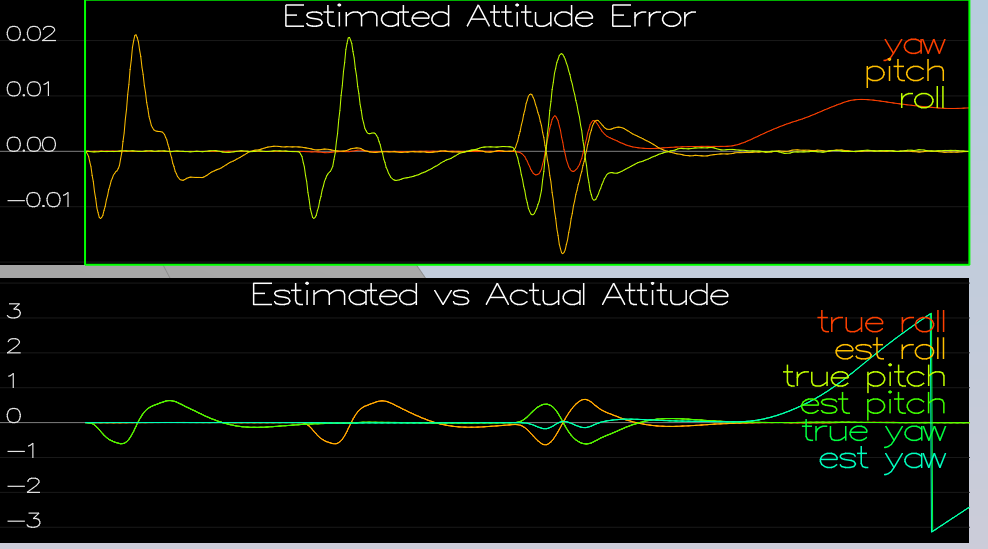
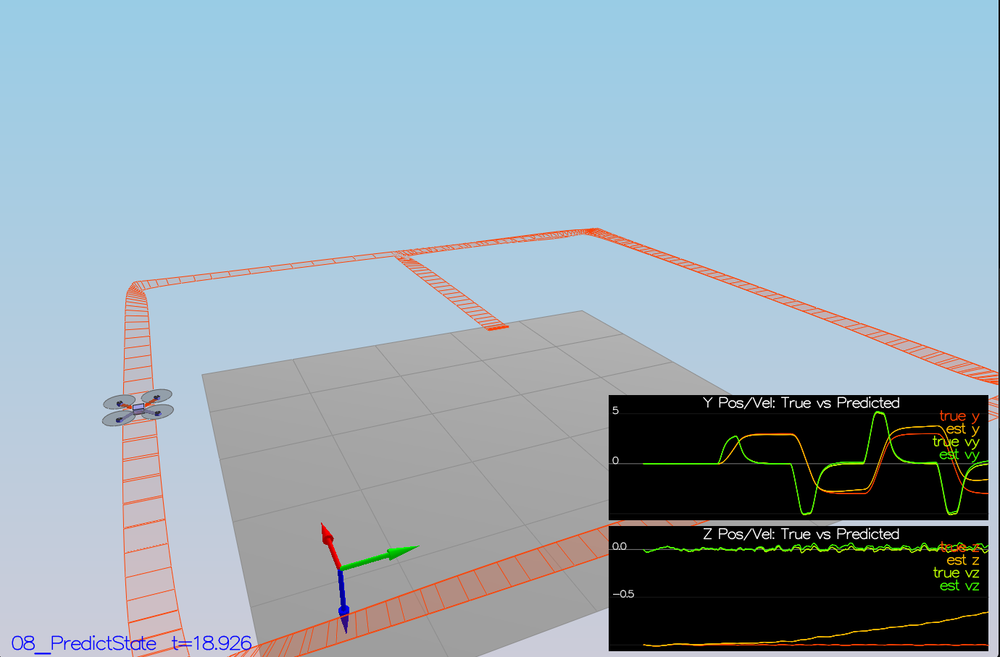
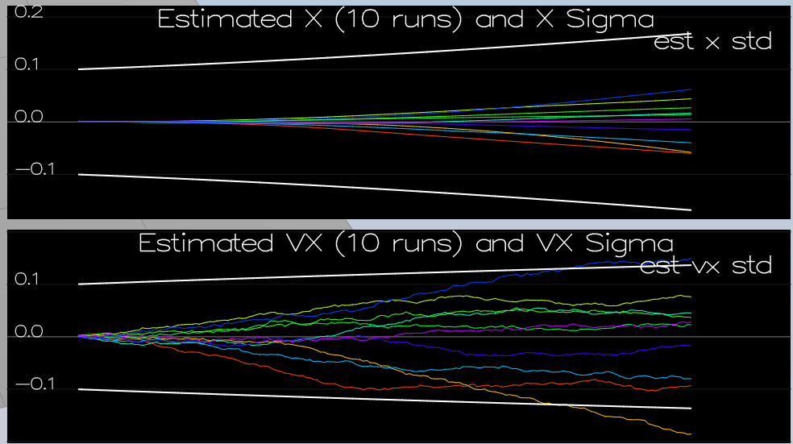
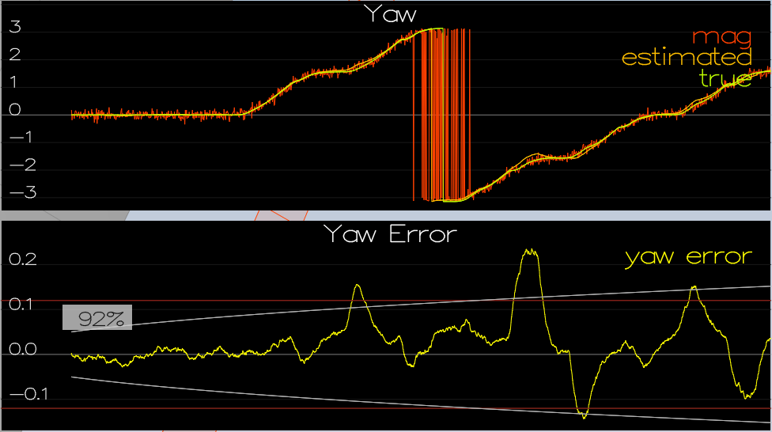
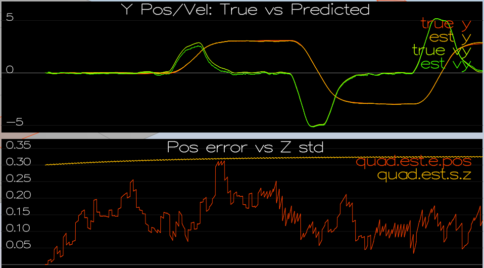
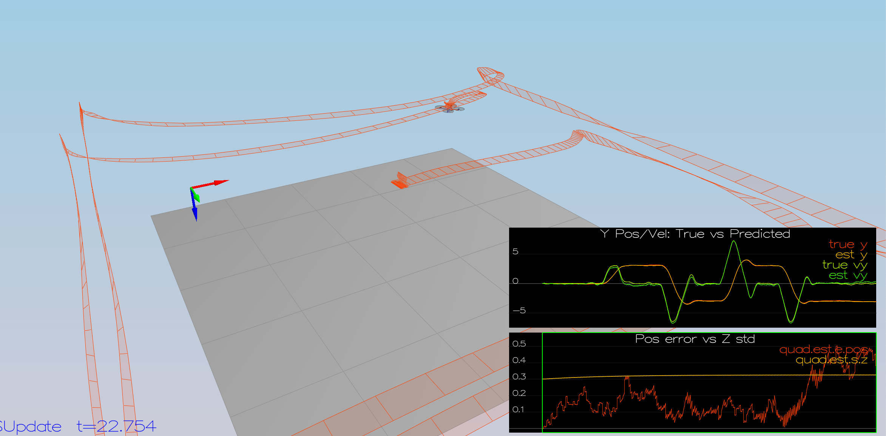

# Estimation Project #

Project outline:

 - [Step 1: Sensor Noise](#step-1-sensor-noise)
 - [Step 2: Attitude Estimation](#step-2-attitude-estimation)
 - [Step 3: Prediction Step](#step-3-prediction-step)
 - [Step 4: Magnetometer Update](#step-4-magnetometer-update)
 - [Step 5: Closed Loop + GPS Update](#step-5-closed-loop--gps-update)
 - [Step 6: Adding Your Controller](#step-6-adding-your-controller)

### Step 1: Sensor Noise ###

I followed the steps as given in the Readme and calculated the two standard deviations, resulting in:

- GPS X Position: 0.725
- IMU X Acceleration: 0.508

Setting these values in the config file, this led to the dashed lines turn green (indicating that I captured approx. 68% of the respective measurements), once I ran the simulator again.

Double checking the calculated values with the ones from the `SimulatedSensors.txt` file, showed that the values I calculated were correct

### Step 2: Attitude Estimation ###

For this task I changed the function `UpdateFromIMU()` in the following way:

```
// Create a quaternion from euler angles
Quaternion<float> attitude = Quaternion<float>::FromEuler123_RPY(rollEst, pitchEst, ekfState(6));
// Integrate the body gyro rates with the given delta t to get angles by making use of the IntegrateBodyRate function
attitude = attitude.IntegrateBodyRate(gyro, dtIMU);

// Extract the Pitch, Roll and Yaw angle of the quaternion
float predictedPitch = attitude.Pitch();
float predictedRoll = attitude.Roll();
ekfState(6) = attitude.Yaw();

// normalize yaw to -pi .. pi
if (ekfState(6) > F_PI) ekfState(6) -= 2.f*F_PI;
if (ekfState(6) < -F_PI) ekfState(6) += 2.f*F_PI;
```

When running the simulation I could see that the error stayed below 0.1 for more than three seconds




### Step 3: Prediction Step ###

I implemented the `PredictState()` function in the following way:

```
// Convert local acceleration vector to global vector
V3F accelGlobal = attitude.Rotate_BtoI(accel);
//V3F gyroGlobal = attitude.Rotate_BtoI(gyro);

// Integrate velocity to position
predictedState(0) += curState(3) * dt; // pos x + vel x * dt
predictedState(1) += curState(4) * dt; // pos y + vel y * dt
predictedState(2) += curState(5) * dt; // pos z + vel z * dt

// Integrate acceleration to velocity
predictedState(3) += accelGlobal.x * dt; // vel x + acc x * dt
predictedState(4) += accelGlobal.y * dt;
predictedState(5) += (accelGlobal.z - 9.81) * dt;
// curState[6] --> Yaw is already integrated in UpdateFromIMU()
```

This gave me the following result in the simulation



...

After setting the parameters `QPosXYStd`, `QPosZStd`, `QVelXYStd` and `QVelZStd` to
QPosXYStd = .1 #.05
QPosZStd = .1 #.05
QVelXYStd = .1 #.05
QVelZStd = .15 #.1

I got the following result




### Step 4: Magnetometer Update ###

After tuning the parameter `QYawStd` I got the following result:




I implemented the `UpdateFromMag()` in the following way:

```
// The derivative of the state vector regarding yaw
hPrime(0, 6) = 1;

// The current yaw from the state vector
zFromX(0) = ekfState(6);

// Normalize
float d = z(0) - zFromX(0);
if (d > F_PI) z(0) -= 2.f * F_PI;
if (d < -F_PI) z(0) += 2.f * F_PI;
```

which lead to the following image:


### Step 5: Closed Loop + GPS Update ###

```
hPrime.setIdentity();
for (int i=0; i<6; i++)
   zFromX(i) = ekfState(i);
```

This is how my implemented code for the GPS Update looks like, which got me this result:



### Step 6: Adding Your Controller ###

Having replaced the two files `QuadController.cpp` and `QuadControlParams.txt` from the controller project I received quite good results, whcih looked like this:


